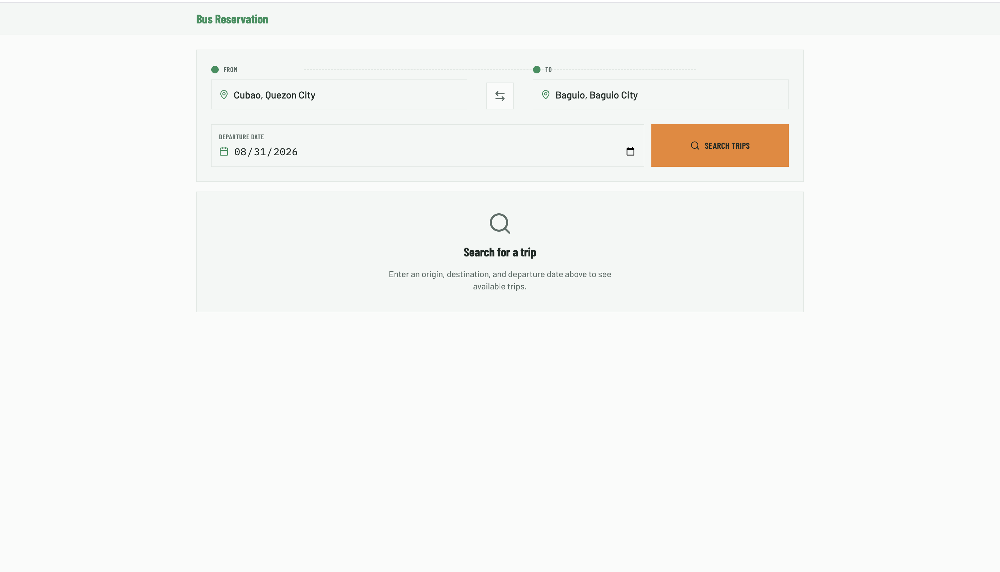
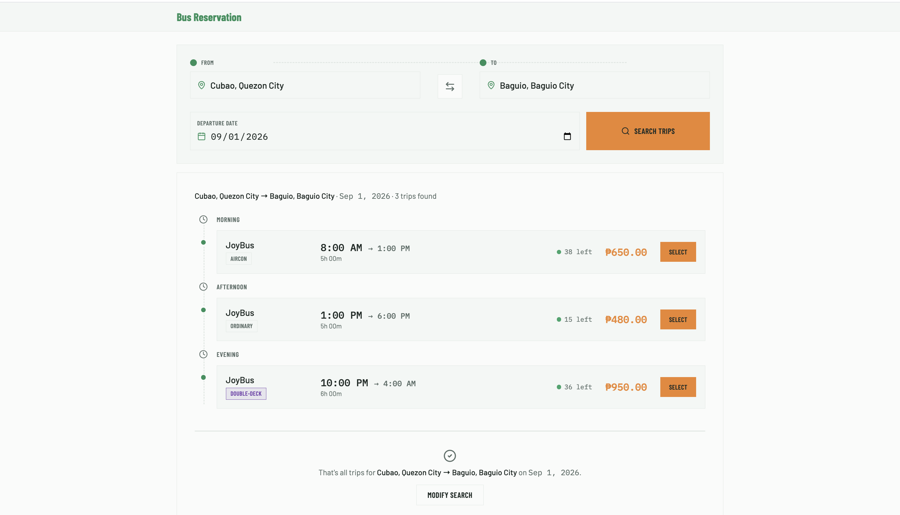
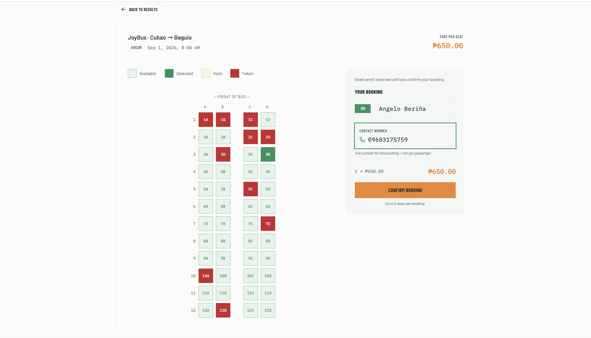
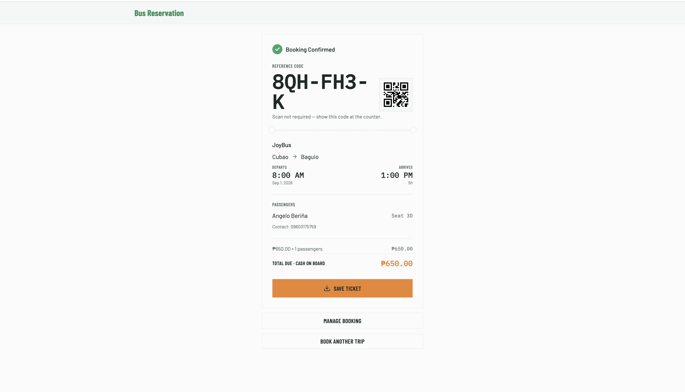

# Bus Reservation

A rider searches for a bus trip between two terminals, books and pays for a seat, and gets a QR
ticket to board with — no account required. Operator staff CRUD their own routes/trips/fleet/fare
rules and run boarding off the trip manifest. Full product scope and rationale live under
[`kos/`](kos/) (start at [`kos/INDEX.md`](kos/INDEX.md)).

**Stack:** Rails 8 (API-only) + MySQL on the backend, Vue 3 + TypeScript + Tailwind CSS on the
frontend, communicating over JSON — see
[`kos/decisions/rails-api-only-vue-spa.md`](kos/decisions/rails-api-only-vue-spa.md).

## Screenshots

Rider flow, end to end — search a trip, pick one, select a seat, get the e-ticket:

| | |
|---|---|
|  |  |
| 1. Trip Search | 2. Trip Search Results |
|  |  |
| 3. Seat Selection | 4. E-Ticket Confirmation |

## Getting started

### Requirements

- Ruby `4.0.5` (see `.ruby-version`)
- Node `24.x` (see `frontend/package.json`)
- MySQL 5.6.4+

### Backend

```sh
bundle install
bin/rails db:setup      # create + migrate + seed
bin/rails server        # http://localhost:3000
```

Database connection is read from `DB_USERNAME` / `DB_PASSWORD` / `DB_HOST` / `DB_PORT` (all
optional locally — see `config/database.yml` for defaults). `FRONTEND_ORIGIN` controls the CORS
allow-list (defaults to Vite's `http://localhost:5173`).

Run the test suite with:

```sh
bin/rails test
```

### Frontend

```sh
cd frontend
npm install
npm run dev              # http://localhost:5173, proxies /api/* to localhost:3000
```

No `.env` needed for local dev (see `frontend/.env.example`) — only required when the built
frontend is served from a different origin than the Rails API in production.

Other frontend commands:

```sh
npm run build             # type-check (vue-tsc) + production build
npm run lint               # eslint
npm run format              # prettier --write
```

## Project structure

- `app/` — Rails API (thin controllers, Form Objects + Interactors for multi-step writes, Query
  Objects, Presenters for JSON formatting — see `kos/decisions/rails-*.md`)
- `frontend/src/` — Vue SPA (`views/rider/`, `views/operator/`, `components/ui/` shared kit,
  `stores/` for cross-screen state, `api/` for the HTTP client)
- `kos/` — the project's knowledge base: scope, decisions, and UX mockups (`kos/decisions/ux/mockups/`)
